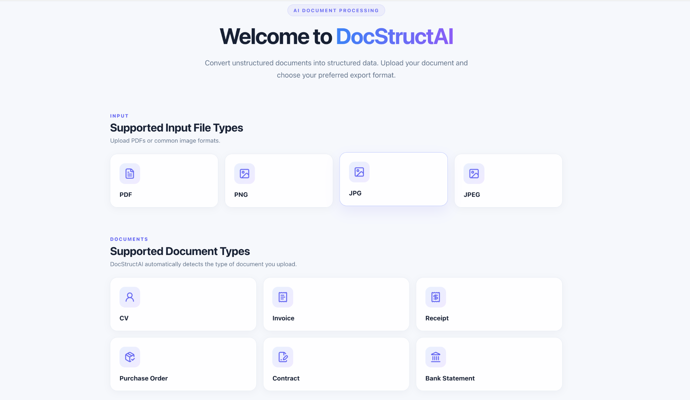
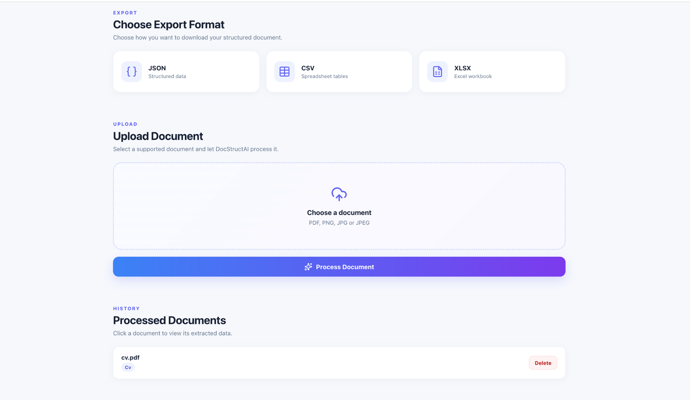
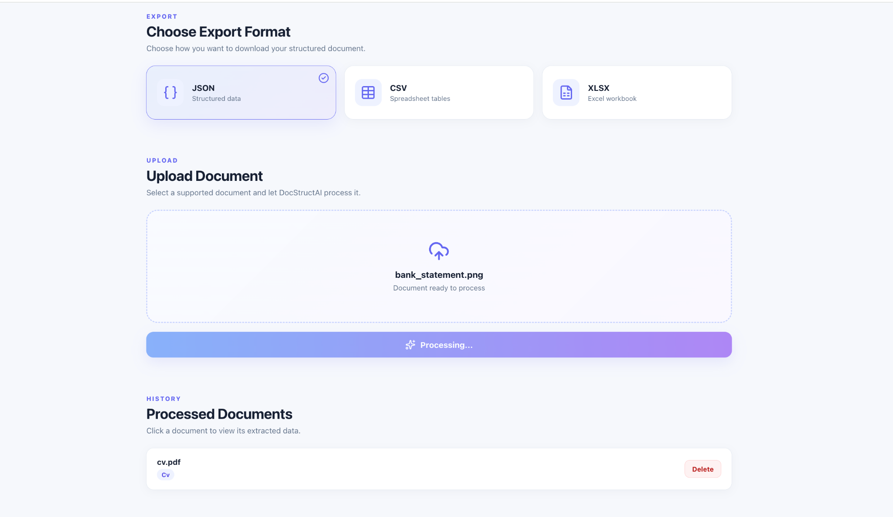
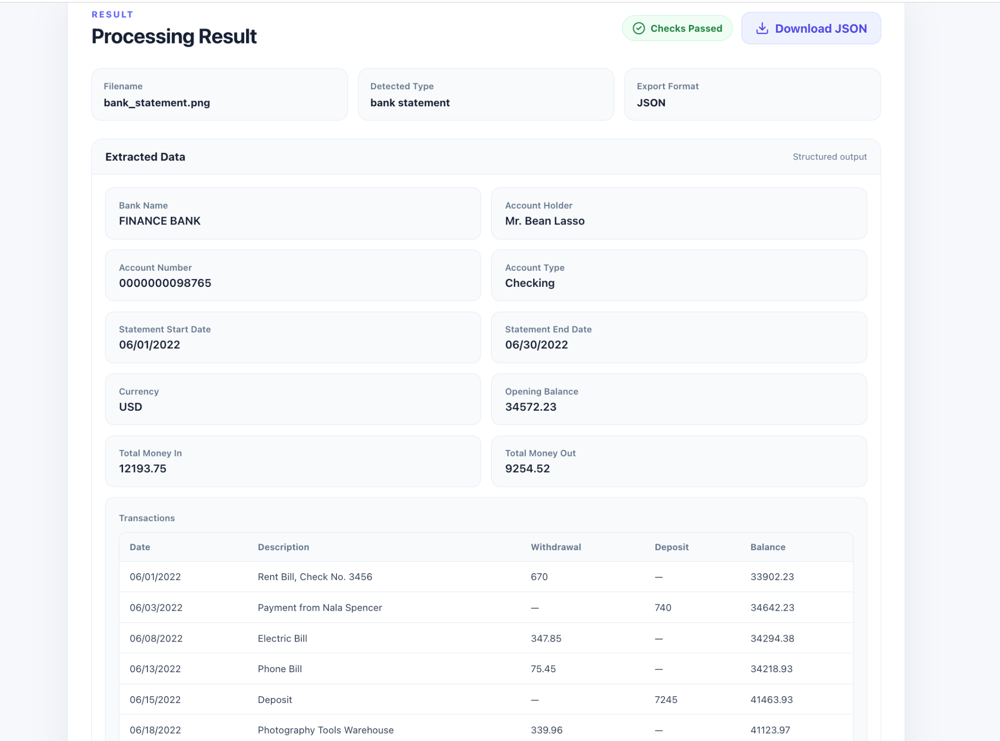

# DocStructAI

### AI-Powered Document Processing, Structured Data Extraction & Validation

DocStructAI is a full-stack document processing application that transforms unstructured information from PDFs and images into organized, machine-readable data.

Users upload a document through a React web interface. DocStructAI extracts its text, automatically identifies the document category, uses the OpenAI API to generate document-specific structured data, and runs validation checks to flag potential discrepancies or inconsistencies. Users can review the results in the application, revisit previously processed documents, and export data as **JSON, CSV, or XLSX (Excel)**.

## Key Features

- **Multiple input formats:** PDF, PNG, JPG, and JPEG.
- **Six document categories:** CVs, invoices, receipts, purchase orders, contracts, and bank statements.
- **Automatic document classification:** Identifies the uploaded document's category.
- **PDF text extraction and OCR:** Uses PyMuPDF for digital PDFs and Tesseract OCR for image-based content.
- **AI-powered structured extraction:** Uses the OpenAI API to interpret extracted text and organize information into document-specific fields.
- **Automated validation:** Checks extracted information for potential discrepancies, inconsistencies, or questionable values, and presents feedback for review. Validation helps flag possible errors but does not guarantee that every extracted field matches the source document.
- **Interactive results:** Displays structured fields and, where applicable, tabular data such as bank transactions.
- **Flexible exports:** Downloads processed data as JSON, CSV, or XLSX files.
- **Document history:** Stores processed results in SQLite, with options to revisit or delete records.
- **Dockerized application:** Runs the FastAPI backend and React frontend together using Docker Compose.

## Application Screenshots

### Supported File Formats & Document Types

DocStructAI accepts PDFs and common image formats and supports six document categories.



### Upload, Export Options & History

Select JSON, CSV, or XLSX, upload a document, and access previously processed documents.



### Document Processing

The application provides a processing state while the uploaded document is being analyzed.



### Structured Extraction Results & Validation

View the detected document type, extracted fields, transaction tables, and validation status.



## Technology Stack

| Component | Technologies |
| --- | --- |
| Frontend | React, JavaScript, Vite, CSS |
| Backend | Python, FastAPI, Pydantic |
| AI Processing | OpenAI API |
| PDF & Image Processing | PyMuPDF, Tesseract OCR, Pillow |
| Validation | Custom Python validation logic |
| Database | SQLite, SQLAlchemy |
| Data Export | JSON, CSV, XLSX (generated using openpyxl) |
| Containerization | Docker, Docker Compose, Nginx |

## How It Works

1. **Upload:** A user selects a supported PDF or image file.
2. **Read:** The backend extracts document text using PDF parsing or OCR.
3. **Classify:** DocStructAI identifies the document category.
4. **Extract:** AI converts unstructured content into document-specific structured fields.
5. **Validate:** Custom checks flag potential discrepancies or inconsistencies for review.
6. **Display:** The React interface presents the extracted information and validation feedback.
7. **Export:** The user downloads structured data as JSON, CSV, or XLSX.
8. **Store:** Processed results are saved in SQLite for later access.

## Getting Started

### Prerequisites

- [Docker Desktop](https://www.docker.com/products/docker-desktop/) (with Docker Compose)
- An OpenAI API key

### Run Locally

1. Clone the repository and enter the project directory:

   ```bash
   git clone https://github.com/YOUR_USERNAME/DocStructAI.git
   cd DocStructAI
   ```

   Replace `YOUR_USERNAME` with the repository owner's GitHub username, and adjust the repository name if necessary.

2. Create a `.env` file in the project root containing your API key:

   ```env
   OPENAI_API_KEY=your_openai_api_key_here
   ```

   **Never commit `.env` or share your API key.** OpenAI API usage may incur charges.

3. Create the local SQLite database file (required by the current Docker Compose bind mount):

   ```bash
   touch docstructai.db
   ```

   The application initializes its database tables when the backend starts. The database file remains on your machine and should not be committed to Git.

4. Build and start the application:

   ```bash
   docker compose up --build
   ```

5. Open the application:

   - **Web interface:** http://localhost:8080
   - **FastAPI documentation:** http://localhost:8000/docs

6. To stop the application, press `Ctrl+C` in the terminal running Docker Compose. To remove the stopped containers and Compose network:

   ```bash
   docker compose down
   ```

   The local database file is preserved.

> **Note:** This is a local development/portfolio setup, not a publicly hosted service. The frontend expects the backend at `http://localhost:8000`.

## Privacy & Security

- Do not commit `.env`, API keys, or the local `docstructai.db` database.
- Avoid publishing real personal or financial documents in screenshots or sample files. Use fictional or appropriately anonymized examples.
- Uploaded document content is processed using the OpenAI API; review the applicable data-handling policies before using sensitive documents.

## Project Status

DocStructAI is a functional, locally runnable portfolio project. Public deployment is not required to run or demonstrate it.
